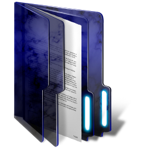

# Welcome to my portfolio! 

My name is Bartosz, and I am a software engineer specialising in web application development.

## TL;DR

I began my career as a software engineer in 2014. 
Over the years, I’ve developed a wide range of projects across multiple programming languages and platforms. 
My journey started with embedded C and C++, where I focused on programming STM32 microcontrollers and building applications using Qt. 
One of the most notable projects from this period was a self-driving line follower robot, which operated using a PID control algorithm and could also be remotely controlled via Bluetooth.

As I progressed, I transitioned into high-level programming, beginning with Java. 
I developed several desktop applications using JavaFX, and later expanded my skills into web development with the Spring framework. 
Around this time, I also briefly explored PHP.

In parallel with learning Spring, I began working with Python. 
I created a neural network using TensorFlow and developed various applications for the Raspberry Pi, as well as web applications using Flask.

Since 2019, my primary focus has been on modern web technologies, particularly Node.js, React, and Kubernetes. 
These tools have become central to my work, and I find great satisfaction in building scalable and efficient applications with them. 
I look forward to continuing to grow within this ecosystem.

| Please find an overview of my projects below | |
| --- | --- |
|[Dice Game](https://github.com/Bartosz95/dice-game)| |
| This is the latest project I was developing in my spare time. It’s a well-designed and engaging game that showcases both technical depth and thoughtful architecture. The application features a React-based GUI and a backend API built with ExpressJS. It also integrates Keycloak for authentication and authorisation. The system utilises both PostgreSQL and MongoDB for data storage, with Mongo-Express included for database management. All components are containerised and deployed on a Kubernetes cluster. I believe this project provides a solid representation of my skills and would be worth exploring if you're interested in assessing my technical capabilities. |

|
|[Chatroom](https://github.com/Bartosz95/chat-room)| |
|The project features a real-time communication website built using Node.js and the Handlebars templating engine. Its core functionality is powered by WebSockets to enable seamless user interaction. | 

 |
|[Traffic Sign Recognition System](https://github.com/Bartosz95/traffic-sign-recognition)| |
|Such systems are designed to assist drivers during vehicle operation. In this project, I developed a custom system and focused on enhancing its performance. The primary objective was to explore and investigate methods for identifying the most effective configuration. | 

 |
|[Air Parameters Monitoring System](https://github.com/Bartosz95/air-parameters-monitoring)| |
|These systems assist drivers during vehicle operation. In this project, I developed one of my own and focused on enhancing its performance. The primary objective was to explore and investigate methods for identifying the optimal setup. | 

 |
|[House Interior Monitoring System](https://github.com/Bartosz95/house-interior-monitor)| | |
|This project provides a comprehensive solution for monitoring the interior environment of a home. It tracks key air quality parameters such as temperature, humidity, and pressure, while also capturing video footage from designated rooms using cameras. All collected data is stored in a centralised database and presented to users through a web-based interface. The system architecture includes a single server that manages data access and at least one sensor unit responsible for data collection. The project was originally developed in 2017. | 

 |
|[Medical Clinics Mananger](https://github.com/Bartosz95/medical-clinics-mananger) | |
|This application provides an efficient solution for managing medical clinics. A key advantage lies in its use of two separate databases, which can be deployed across different locations. The data is distributed using both horizontal and vertical partitioning, depending on the table structure. For more details on the distributed database architecture, please refer to the project documentation. Additionally, the system includes a desktop application developed using JavaFX. | 

|
|[KidnApp - Android App](https://github.com/Bartosz95/KidnApp)| |
|KidnApp enhances your personal safety by providing an emergency alert feature. In the event of danger, pressing both the volume up and volume down buttons simultaneously for eight seconds will activate the app. Once activated, it will automatically send SMS messages containing your location and a predefined alert message to your selected contacts every three minutes. | 

 |
|[Linefollowers](https://github.com/Bartosz95/linefollowers)| |
|The Linefollower is a mobile robot designed to follow a designated path. My robots were primarily developed for competitive purposes, with a key focus on optimising their speed. Some models also featured remote control capabilities. I independently managed the entire development process, including designing the circuit board, fabricating and soldering the components, programming the microcontroller, and deploying the software. | 

 |
|[Memo Game](https://github.com/Bartosz95/memo-game)| |
|This is a straightforward memo game developed using JavaFX. While the game is relatively simple, it was created primarily as a recreational project. | 

 |
